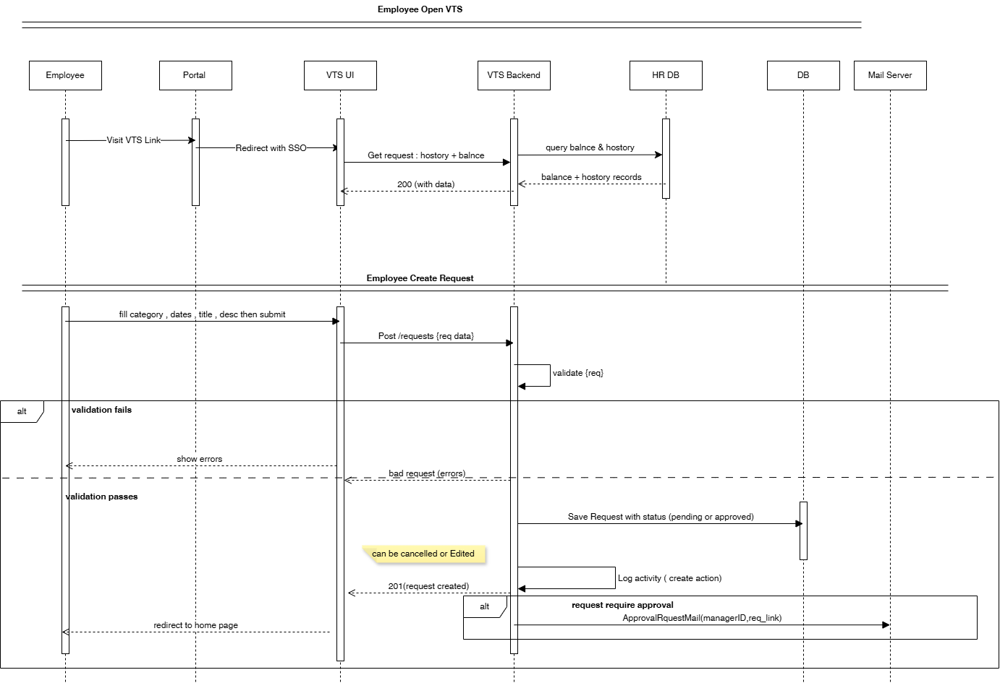
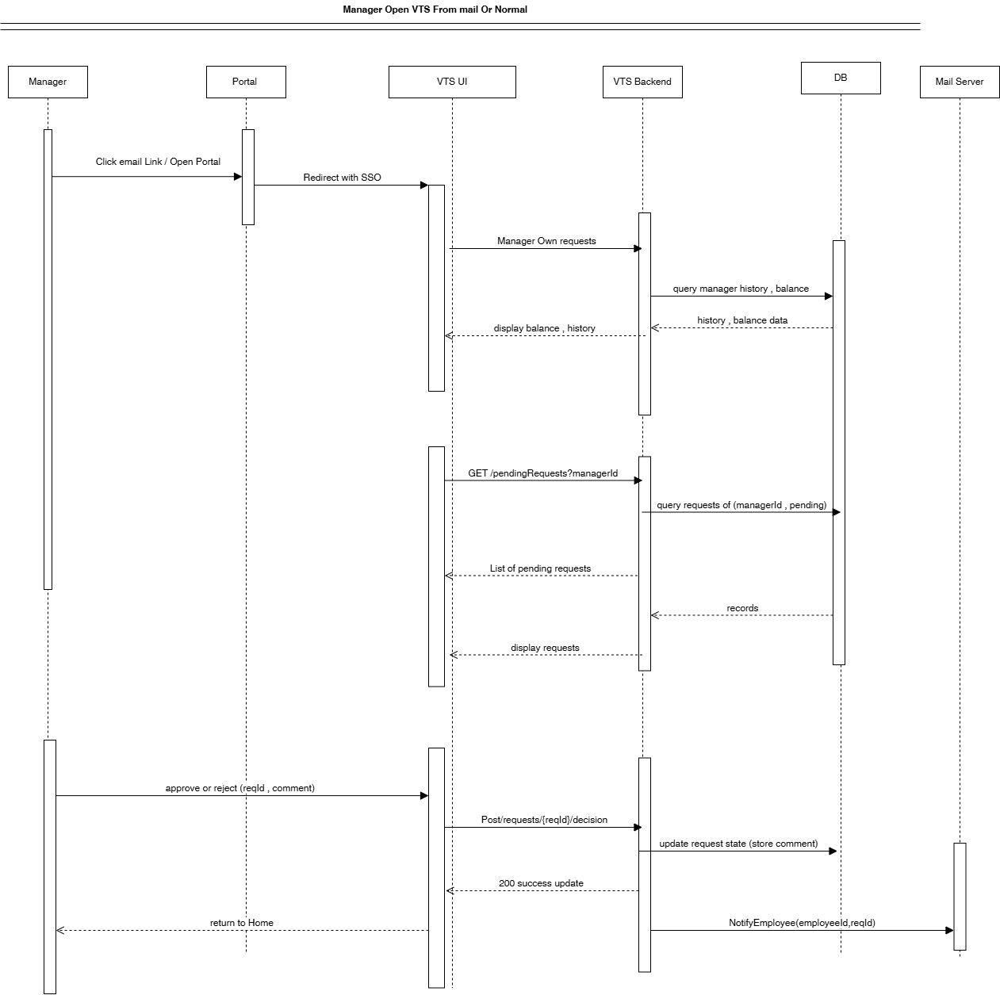
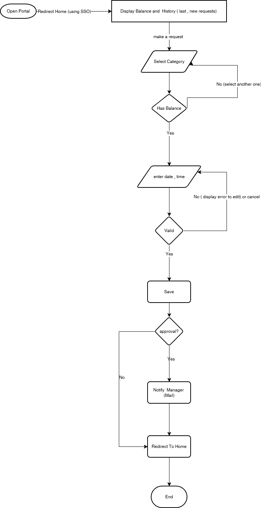
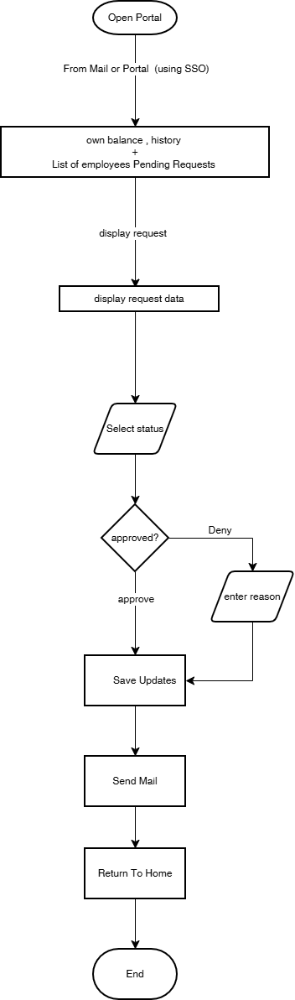

# Vacation Tracking System SRS

## Vision
The Vacation Tracking System (VTS) aims to empower employees to independently manage their vacation, sick leave, and personal time off through an easy-to-use and intelligent system. Its vision is to simplify HR operations, reduce managerial workload on noncore tasks, and enhance employee autonomy and responsibility in managing their leave, all through an intuitive and user-friendly platform.

## Functional Requirements
- Flexible rules-based validation system (using configurable business rules).
- Manager approval process: The system should enable (optionally) managers to approve employee leave requests.
- View and create leave requests: The system must allow employees to access past requests (previous calendar year) and create new requests up to 1.5 years in advance.
- Email notifications: to request manager approval and notify employees of request status changes.
- Activity logging: The system must log all transactions and actions performed.
- HR and admin overrides: HR and system administrators must be able to override restricted actions, with all overrides logged.
- Manager leave award: Managers must be able to directly grant personal leave time to employees, within system-defined limits.
- Web service interface: The system must provide a web service API to allow other internal systems to query an employee’s vacation summary.

## Non-Functional Requirements
- Easy to use and user friendly.
- The system must use the portal’s single sign-on (SSO) for user authentication.

## Constraints
- Use existing hardware and middleware (same infrastructure).
- The system must be implemented as an extension to the existing intranet portal.
- Integration with HR legacy systems.

## Use Case
### Actor: Employee
### Goal: The employee wishes to submit a new request for vacation time.
### Preconditions: The employee is authenticated by the portal framework and identified as an employee of the company with privileges to manage his or her own vacation time.

### Main Flow
1) Employee Access: The employee logs into the company intranet portal and opens the Vacation Tracking System (VTS) through a secure Single Sign-On (SSO) link.

2) View Status: VTS automatically retrieves and displays the employee’s current leave balances and past/future vacation requests (6 months back, 18 months ahead).

3) Create Request: The employee selects a vacation category with available balance, chooses desired dates from a visual calendar, enters hours, title, and description, then submits the request.

4) Validation: The system validates the submitted data.
 - If errors exist → the form is redisplayed with highlighted issues.
 - If valid → the request is processed.

5) Manager Approval: If approval is required, VTS sends an email notification to the employee’s manager and marks the request as Pending Approval.

6) Manager Review: The manager opens the link from the email or accesses VTS via the portal, reviews pending requests, and either approves or rejects each one. If rejected, a reason must be provided.

7) Notifications: Once a decision is made, VTS updates the request status and sends an email notification to the employee with the outcome.

8) Completion: Both employee and manager can view updated request statuses, submit new ones, or exit the system.

### Data Models :
| Entity              | Attributes                                                           | Relationships                      |
| ------------------- | -------------------------------------------------------------------- | ---------------------------------- |
| **Employee**        | id, name, email, balance, manager_id                                 | Each employee may have one manager |
| **VacationRequest** | id, employee_id, start_date, end_date, category, status, description | Belongs to an employee             |
| **Manager**         | id, name, email                                                      | Has many employees                 |
| **HR_Admin**        | id, name, email                                                      | Can override actions               |

### Diagrams
 Employee Sequence Digram :
 Sequence : 

 Manager Sequence Digram :

### Flow Charts : 
 Employee Request  :  
 

 Manager Descion :

 

### pseudocode : 
    START
    Employee clicks "Open VTS" via intranet portal (SSO)

    IF user authenticated by SSO THEN
    VTS retrieves employee balances and requests (6 months back, 18 months ahead)
    Display balances and request history
    ELSE
    Redirect to portal login
    STOP
    END IF

    Employee creates a vacation request:
    - choose category with positive balance
    - select dates and hours (via calendar)
    - enter title and short description
    - submit request

    System validates request:
    IF validation fails THEN
        show validation errors and allow edit or cancel
        GO BACK to "Employee edits request"
    ELSE
        IF request requires manager approval THEN
        save request with status = PENDING
        send approval email to manager(s)
        ELSE
        save request with status = APPROVED
        send confirmation email to employee
        END IF
    END IF

    When manager responds:
    IF manager approves THEN
        update request status = APPROVED
    ELSE
        update request status = REJECTED and save manager reason
    END IF
    send notification email to employee

    END

